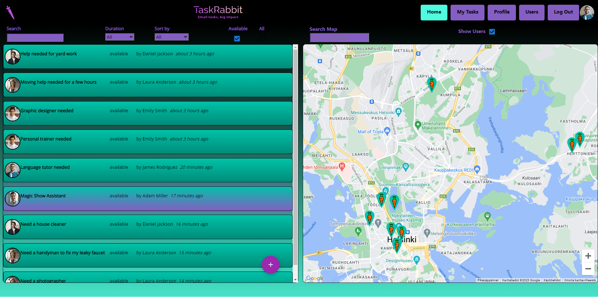
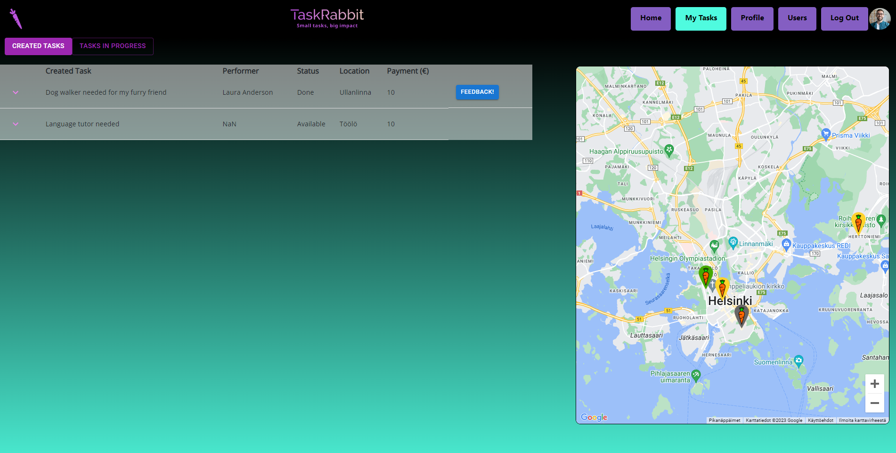

# TaskRabbit
## *Small Tasks, Big Impact*

TaskRabbit is a user-friendly web application that connects individuals seeking help with those offering assistance. Users can easily post tasks if they need assistance or earn a small income by browsing through available opportunities and performing tasks. With a profile page showcasing user statistics and reviews, as well as an interactive Google Maps integration, TaskRabbit creates a community where tasks are accomplished efficiently and collaboratively.
### Main View  
The main view of TaskRabbit showcases a list of posted tasks accompanied by an interactive Google Maps view. Users can search, filter, and sort tasks based on criteria like text input, duration, and price. Additionally, the map feature enables location search for a more intuitive task exploration experience. Moreover, users can conveniently add new tasks directly from this page.

  

### My Tasks  
The My Tasks view in TaskRabbit provides users with a convenient way to manage their created tasks, tasks in progress, and completed tasks. Users can give feedback to others and mark tasks as done, while an interactive Google Maps component showcases the tasks' locations. This view fosters seamless task management and facilitates user-to-user feedback, enhancing the collaborative nature of TaskRabbit.  
  

### Profile Page  

The Profile Page in TaskRabbit showcases the user's profile picture and header image. It includes an Overview section with user statistics, such as completed tasks and tasks in progress. The Profile Review component displays reviews and ratings given by others, enhancing the user's reputation within the community. It serves as a central hub for managing the user's online presence and fostering trust among TaskRabbit users.

  

### Users of the Application  

The Users Page in TaskRabbit provides a comprehensive directory of all application users, featuring their usernames, profile images, and average ratings based on reviews. This page serves as a valuable resource for users to discover and connect with other members of the TaskRabbit community. 

  

## Techniques

### Front-end

<table>
<tbody>
  <tr>
    <td></td>
    <td></td>
    <td></td>
    <td></td>
  </tr>
  <tr>
    <td>JavaScript</td>
    <td>React</td>
    <td>React Redux & RTK Query</td>
    <td>Bootstrap</td>
  </tr>
</tbody>
</table>

### Back-end

<table>
<tbody>
  <tr>
    <td></td>
    <td></td>
    <td></td>
  <tr>
    <td>Java</td>
    <td>Spring Boot</td>
    <td>MySQL</td>
  </tr>
</tbody>
</table>

### Cloud

<table>
<tbody>
  <tr>
    <td></td>
    <td></td>
    <td></td>
    <td></td>

  <tr>
    <td>Amazon Web Services</td>
    <td>Relational Database Service</td>
    <td>Simple Storage System</td>
    <td>Elastic Beanstalk</td>
  </tr>
</tbody>
</table>

This project uses a combination of front-end, back-end, and cloud technologies. On the front-end, the project uses JavaScript as its main programming language, React as the main library for building user interfaces, React Redux for state management, RTK Query for data fetching, and Bootstrap for responsive web design. On the back-end, the project uses Java as the main programming language, Spring Boot as the main framework, and MySQL as the database. The project is deployed on the AWS cloud platform and utilizes various services such as RDS for the MySQL database, Elastic Beanstalk for deployments, and S3 for storing static assets.

## Installation

- Clone the repository  
`git clone git@github.com:arska2/TaskRabbit.git`  
- Use taskrabbit.sql (in root directory of this repository) to set up the MySQL database locally  
`mysql -u <username> -p <database_name> < taskrabbit.sql`
- start server (run in server folder)   
    `mvnw spring-boot:run`   
- Install front-end dependencies   
`cd client`  
`npm i`  
- Start React App  
`npm start`

The back-end database API is hosted on localhost:8080, and the front-end React app can be found at localhost:3000.

